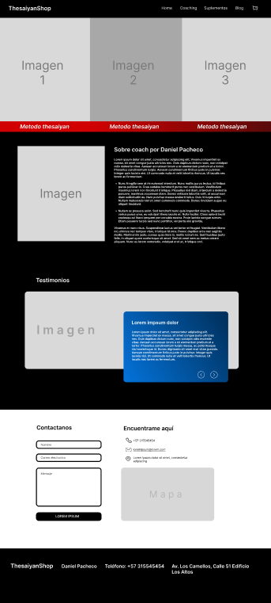
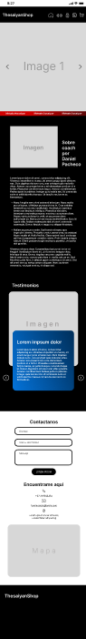
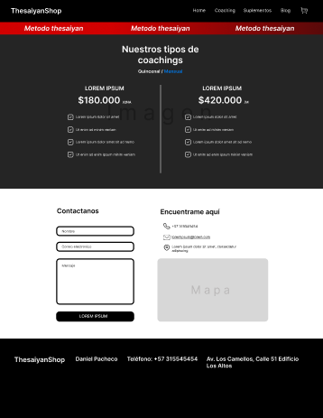
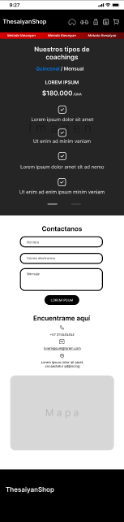
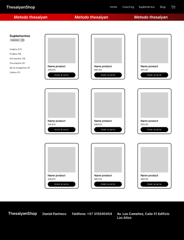
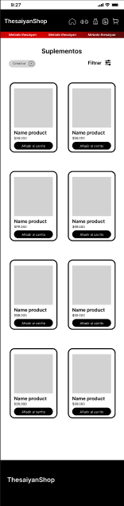
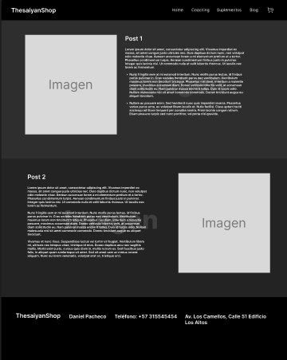
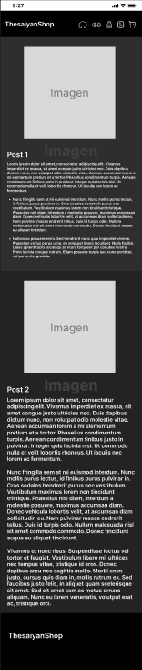
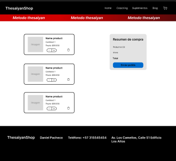
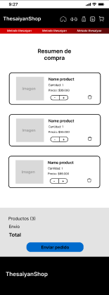

# TheSaiyan Shop

Tienda de productos y servicios deportivos

## Tabla de contenidos

-   [Mockup](#Mockup)
-   [Home](#Home)
-   [Coaching](#Coaching)
-   [Suplementos](#Suplementos)
-   [Blog](#Blog)
-   [Cart](#Cart)
-   [Autor](#Authors)

## Mockup

Para la maquetacion se tuvo en cuenta las necesidades del cliente, y el enfoque al que estan enlazados sus productos y servicios, se utilizo la paleta de colores elegida por el cliente usando los colores negro y rojo con mayor relevancia para seguir la identidad de la marca. El maquetado se realizo en Figma empleando una version desktop y una version movil (La maqueta puede tener cambios durante el proceso de desarrollo).

[Previsualizacion de Mockup](https://www.figma.com/proto/0wjuJOHsPPckNSHrY30ATW/ThesaiyanShop?type=design&node-id=1-2&t=VWf5eN854sZtwhrJ-1&scaling=min-zoom&page-id=0%3A1&mode=design).

## Home

En el Home vamos a encontrar diferentes secciones, primeramente vamos a ver un contenedor con 3 imagenes elegidas por el cliente, este contenedor en la version movil se visualiza como un slide.

Despues vamos a encontrar un post escrito por el cliente hablando sobre el.

Mas adelante encontramos la tarjeta de testimonios, aca podremos visualizar los testimonios escritos por los usuarios que hayan hecho uso de los servicios.

Luego encontramos la seccion contactanos en la cual los posibles usuarios podran ubicar o contactar al cliente.

Finalmente un footer informativo
[Home](https://cesarbaquiro.github.io/thesaiyanShop/)

## Coaching

En coaching los usuarios van a encontrar costos para servicio de coaching en la modalidad quincenal y mensual y los servicios a los que van a tener acceso

Luego encontramos la seccion contactanos en la cual los posibles usuarios podran ubicar o contactar al cliente.

Finalmente un footer informativo

[Coaching](https://cesarbaquiro.github.io/thesaiyanShop/pages/coaching.html)

## Suplementos

Aca podemos encontrar un catalogo con los productos de suplementos, en el lado izquierdo podemos encontrar opciones de filtrado.

Finalmente un footer informativo

[Catalogue](https://cesarbaquiro.github.io/thesaiyanShop/pages/catalogue.html)

## Blog

En la pagina blog encontramos diferentes articulos los cuales van a ser escritos y actualizados por el cliente.

Finalmente un footer informativo

[Blog](https://cesarbaquiro.github.io/thesaiyanShop/pages/blog.html)

## Cart

Aca podemos encontrar los productos que los usuarios agregan al carrito al navegar por la pagina, aca pueden realizar sus pedidos.

Finalmente un footer informativo

[Cart](https://cesarbaquiro.github.io/thesaiyanShop/pages/cart.html)

## Authors

-   [@CesarBaquiro](https://github.com/CesarBaquiro?tab=repositories)
